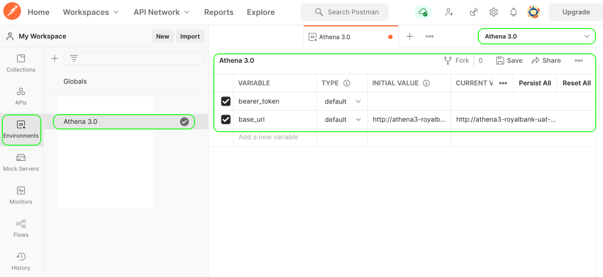

ATHENA is an advanced real-time transaction monitoring solution designed to detect and prevent money laundering, fraud, and terrorism financing. Powered by proprietary AML rules, ATHENA analyzes transactions in real time, providing clear, intuitive visual insights to streamline compliance processes.

✅ Real-Time Monitoring – Instantly analyzes transaction data to detect anomalies and potential compliance risks. 
✅ Visualized Insights – Converts complex data into easy-to-understand charts, aiding faster decision-making. 
✅ Seamless Integration – Easily integrates with existing financial and compliance systems. 

Ideal for financial institutions, fintech companies, and regulated businesses, ATHENA enhances risk management and ensures regulatory compliance with ease.

## Introduction

This documentation serves as a reference and guide for Athena 3.0 client API users to be familiar with the relevant workflow and APIs. The left panel displays the list of workflow phases and within it, there will be a sublist of information displaying the APIs involved and the expected behaviour.  
Please refer to the following Postman Collection for the use of the Athena APIs. Before using the API, please proceed to the Authentication section to get an idea on how to setup a token.  
In order to test the collection, you should create an environment for Athena and add <b>base_url</b> and <b>bearer_token</b> as variables or add as global variables. For the <b>bearer_token</b> refer to Authentication while the <b>base_url</b> will be provided by Cynopsis.  

<Frame>
  
</Frame>

[Athena Postman Collection Link](https://developer.cynopsis.co/assets/postman-collections/athena3-external.json)

## Requirements

<b>Athena3 API Endpoint(URL)</b>:This will be provided by Cynopsis   
<b>Authentication</b>: We are using Bearer token, please generate the access_token base on Authentication section  
<b>API Headers</b>: We are using content-type <b>application/json</b> for all of our APIs.  

Copyright © 2019 Cynopsis Solutions Pte. Ltd.
All content in this website, including images, api documentation are the property of Cynopsis Solutions Pte Ltd. Any unauthorised disclosure, dissemination, distribution, copying or re-producing any aspect of this document or the creation of derivative of such content is prohibited. It is intended only for reference and use of the intended recipient(s). All rights reserved.