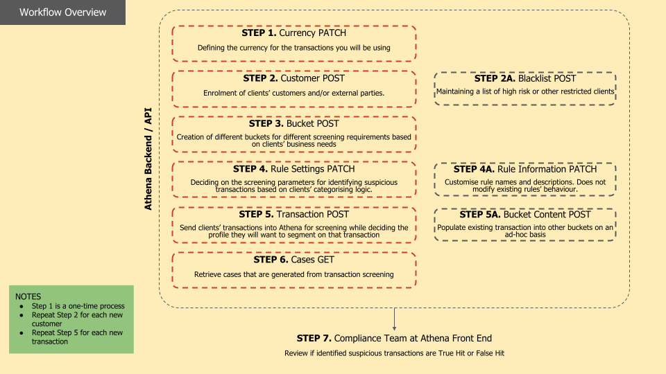

The diagram below demonstrates the basic workflow for registering the necessary information to perform screening on the dataset. 
For more details on each section, please refer to the relevant sub-section.

<Frame>
  
</Frame>